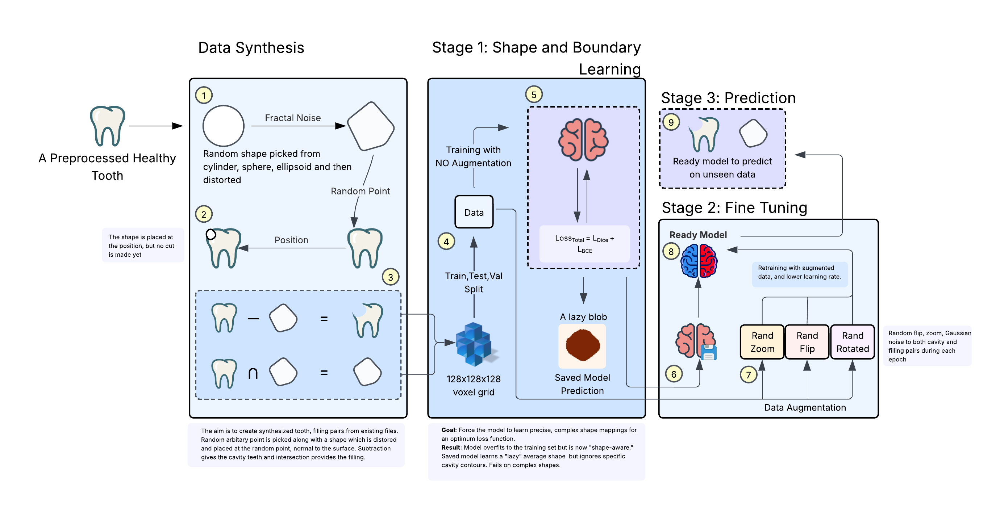

# Tooth Cavity-Filling Reconstruction Using 3D U-Net

Tooth cavity is a growing convern among people of any age. Special attention is needed in the early stage to prevent root canal or tooth loss. Tradition method to preserve the tooth involves, is to 
clean the decayed surface, and fill it up. However this filling is hand placed and does not help in preserving the original shape of the tooth prior to decaying. This project aims at producting the
shape of the necessary filling/volume needed for a decayed tooth.

---

## Overview

The workflow consists of two major phases:

1. **Data Synthesis** – Due to limited true data, 3D cavity–filling pairs are generated from healthy tooth meshes using procedural geometry and fractal noise.
2. **Training** – Training a 3D U-Net to predict fillings that fit the cavities using voxelized binary volumes.

The model learns to infer cavity shape, volume, and structure from the input cavity mesh, producing realistic filling predictions. To keep things simple, initally the
synthesized dataset is created using one cavity pockets per tooth.

---

## Methodology

  

### 1. Data Preprocessing
- The original dataset contained **15 lower jaw healthy teeth** in `.stl` format.
- Meshes were inconsistent, broken, or non-watertight, requiring extensive cleanup in **Blender**.
- Each mesh was:
  - Cropped to remove broken ends.
  - Aligned to the origin (crown facing +Z).
  - Re-meshed with a voxel size of `0.1m` for uniform resolution.

### 2. Data Synthesis
- Using the cleaned dataset, **1,050 cavity–filling pairs** were automatically generated.
- Cavities were created using **Boolean subtraction** of synthetic 3D shapes:
  - Sphere
  - Ellipsoid
  - Cylinder  
- To make cavities more realistic, **fractal noise** was applied to deform base shapes.
- Shapes were aligned to tooth surfaces using **Rodrigues’ rotation formula**, then embedded slightly below the surface.
- To ensure, the holes don't reach the roots, only top 30% of the tooth was used.
- The **filling mesh** was generated via Boolean intersection with the original tooth.

### 3. Training
- Each tooth and filling was voxelized to a **128×128×128** binary grid.
- **Flood-fill** ensured solidity of the meshes.
- The task was formulated as **3D image-to-image translation**.

#### Model
- Architecture: **3D U-Net** (encoder–decoder)
- Loss Function:
  - Dice Loss  
  - Binary Cross-Entropy (BCE) Loss  
  - Combined:  Ltotal = LDice + LBCE
- Optimizer: **Adam**
- Techniques: **Early Stopping** and **Learning Rate Scheduler**
- Training Phases:
  1. **Stage 1:** Train without augmentation (to learn cavity-to-filling mapping)
  2. **Stage 2:** Retrain with augmentations (rotation, zoom, noise, flips)

---
## Results

| Metric | Training Set | Test Set |
|--------|---------------|----------|
| Combined Loss | 0.2891 | 0.2816 |
| Dice Score | 0.8530 | 0.8497 |
| Precision | 0.9036 | 0.9059 |
| Recall | 0.8871 | 0.8824 |

Example inference result on unseen data:

| Metric | Score |
|--------|--------|
| Dice Score | 0.8347 |
| IoU (Jaccard) | 0.7163 |
| Mean Squared Error | 0.0542 |

Due to computational difficulties, voxel grid of 128x128x128 and during re-meshing voxel size of 0.1m was chosen. A higher grid and a lower size
would have resulted in better output and result, requiring more computational power. The synthesized dataset generated cavity-pockets arbitarily
with differenct geometry, resulting in very few examples having sharp, long, narrow pockets which seemed unnatural. With more training examples
the model can be re-trained to learn this outliers as well if needed.

---
