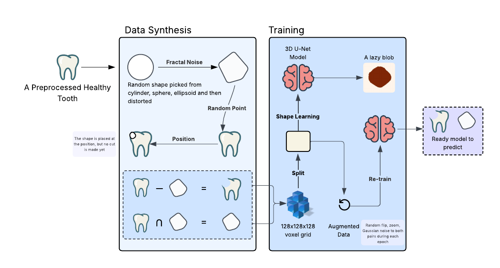

# Tooth Cavity Reconstruction Using 3D U-Net

The aim of this project is to predict the shape of the filling needed to fill the cavity pocket of decayed tooth.

---

## Overview

The workflow consists of two major phases:

1. **Data Synthesis** – Due to limited true data, 3D cavity–filling pairs are generated from healthy tooth meshes using procedural geometry and fractal noise.
2. **Training** – Training a 3D U-Net to predict fillings that fit the cavities using voxelized binary volumes.

The model learns to infer cavity shape, volume, and structure from the input cavity mesh, producing realistic filling predictions.

---

## Methodology

  

### 1. Data Preprocessing
- The original dataset contained **15 lower jaw healthy teeth** in `.stl` format.
- Meshes were inconsistent, broken, or non-watertight, requiring extensive cleanup in **Blender**.
- Each mesh was:
  - Cropped to remove broken ends.
  - Aligned to the origin (crown facing +Z).
  - Re-meshed with a voxel size of `0.1m` for uniform resolution.

### 2. Data Synthesis
- Using the cleaned dataset, **1,050 cavity–filling pairs** were automatically generated.
- Cavities were created using **Boolean subtraction** of synthetic 3D shapes:
  - Sphere
  - Ellipsoid
  - Cylinder  
- To make cavities more realistic, **fractal noise** was applied to deform base shapes:
  \[
  FractalNoise(p) = \sum_{i=0}^{octaves-1} amplitude_i \times BaseNoise(frequency_i \times p)
  \]
- Shapes were aligned to tooth surfaces using **Rodrigues’ rotation formula**, then embedded slightly below the surface.
- The **filling mesh** was generated via Boolean intersection with the original tooth.

### 3. Training
- Each tooth and filling was voxelized to a **128×128×128** binary grid.
- **Flood-fill** ensured solidity of the meshes.
- The task was formulated as **3D image-to-image translation**.

#### Model
- Architecture: **3D U-Net** (encoder–decoder)
- Loss Function:
  - Dice Loss  
  - Binary Cross-Entropy (BCE) Loss  
  - Combined:  
    \[
    L_{total} = L_{Dice} + L_{BCE}
    \]
- Optimizer: **Adam**
- Techniques: **Early Stopping** and **Learning Rate Scheduler**
- Training Phases:
  1. **Stage 1:** Train without augmentation (to learn cavity-to-filling mapping)
  2. **Stage 2:** Retrain with augmentations (rotation, zoom, noise, flips)

---
## Results

| Metric | Training Set | Test Set |
|--------|---------------|----------|
| Combined Loss | 0.2891 | 0.2816 |
| Dice Score | 0.8530 | 0.8497 |
| Precision | 0.9036 | 0.9059 |
| Recall | 0.8871 | 0.8824 |

Example inference result on unseen data:

| Metric | Score |
|--------|--------|
| Dice Score | 0.8347 |
| IoU (Jaccard) | 0.7163 |
| Mean Squared Error | 0.0542 |

---
